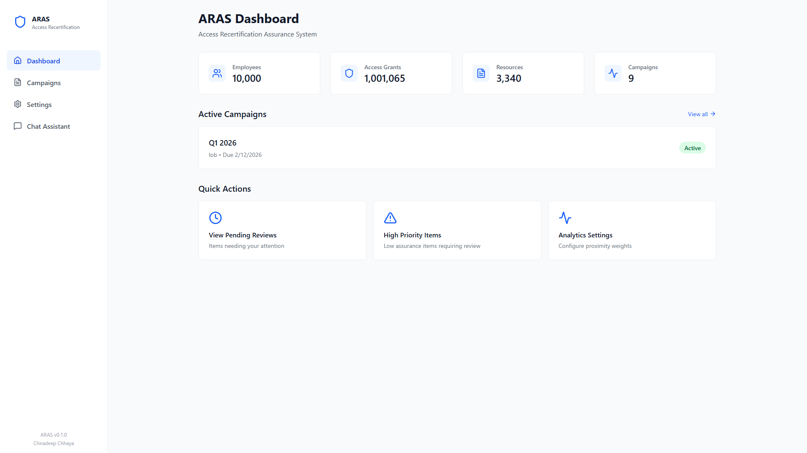
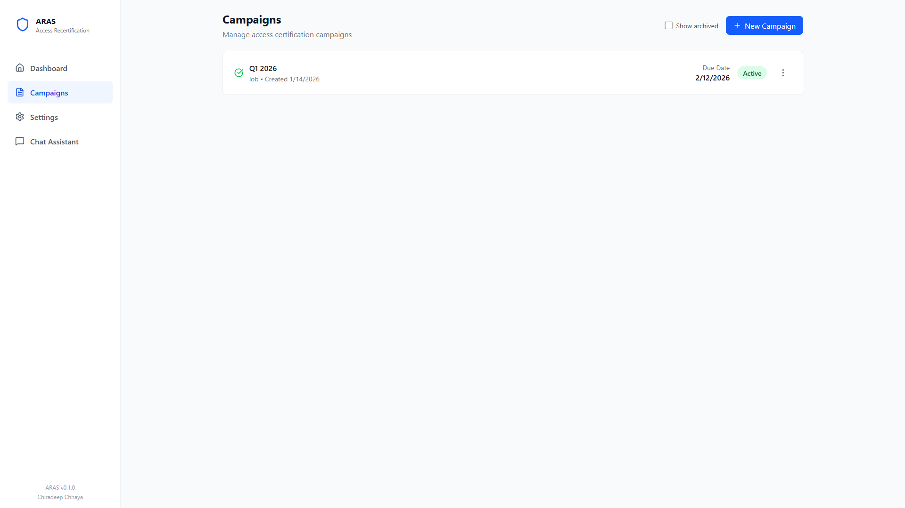
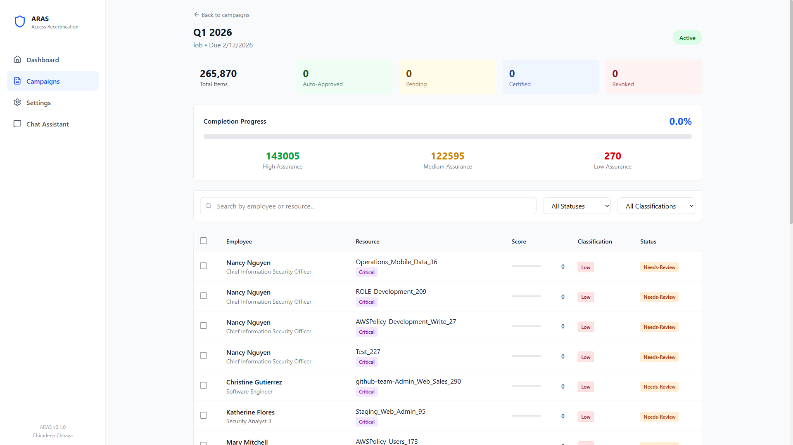
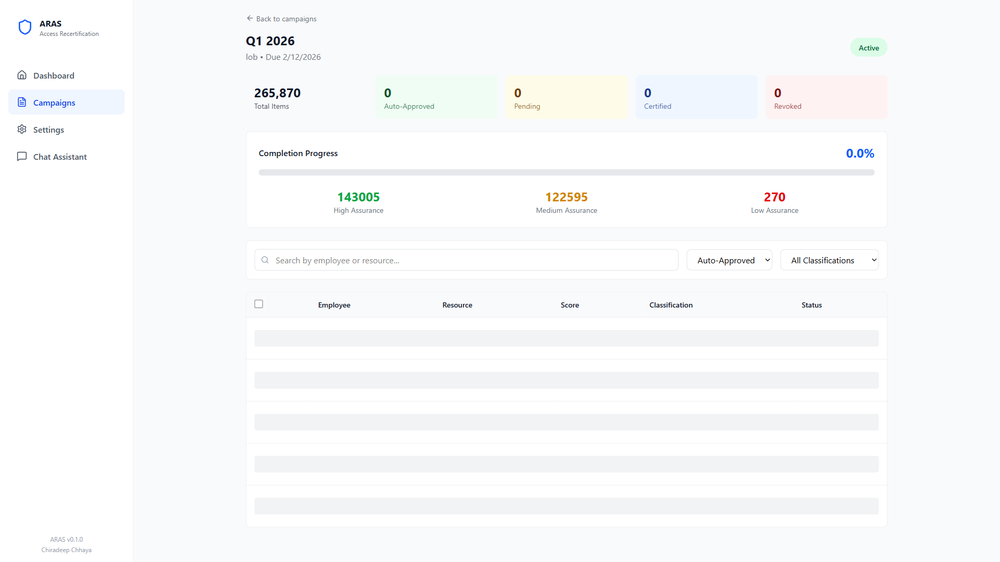
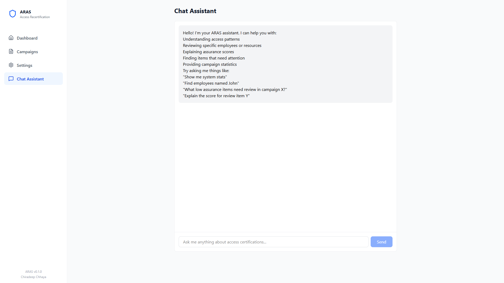
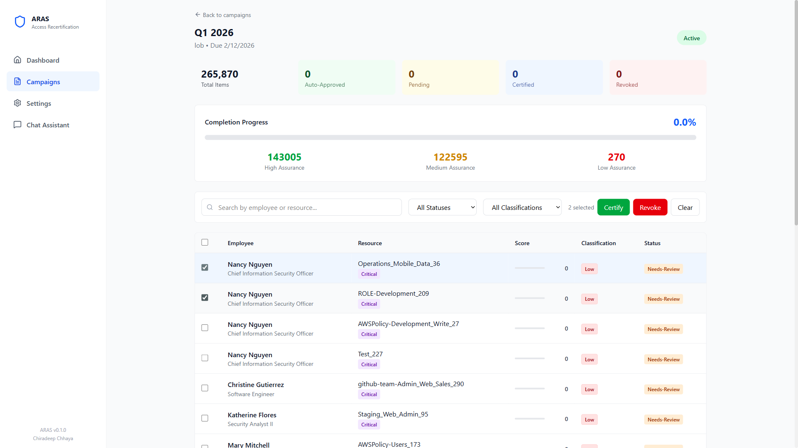

<p align="center">
  
</p>

<h1 align="center">ARAS</h1>
<h3 align="center">Access Recertification Assurance System</h3>

<p align="center">
  <em>Transforming access certification from rubber-stamping to risk-focused intelligence</em>
</p>

<p align="center">
  <a href="#demo">View Demo</a> &bull;
  <a href="#the-problem">The Problem</a> &bull;
  <a href="#the-solution">The Solution</a> &bull;
  <a href="#quick-start">Quick Start</a> &bull;
  <a href="docs/position-paper.md">Position Paper</a>
</p>

---

> **Disclaimer**: This is a **demonstration system** showcasing modern access recertification concepts. It is based entirely on publicly available literature and research in identity governance. This is **not production-ready software** and is intended solely for educational, research, and proof-of-concept purposes.

---

**Author:** Chiradeep Chhaya

## The Problem

Traditional access recertification is broken. Despite being a foundational control in enterprise identity governance, it has devolved into **compliance theater**:

| Problem | Impact |
|---------|--------|
| **Volume Overload** | Reviewers face thousands of items with no differentiation |
| **Rubber-Stamping** | Time pressure leads to blanket approval of everything |
| **Missing Context** | No information about what's typical vs. unusual |
| **Binary Decisions** | Just approve/reject with no nuance or risk assessment |
| **Audit Fatigue** | Identical treatment of critical and trivial access |

The result? A process that satisfies compliance requirements while providing minimal actual security value.

## The Solution

ARAS introduces **risk-based assurance scoring** that focuses human attention where it matters most:

### Core Concepts

```
┌─────────────────────────────────────────────────────────────────┐
│                     ASSURANCE SCORING                           │
├─────────────────────────────────────────────────────────────────┤
│                                                                 │
│   raw_score = (peer_typicality × 0.7) + (usage_factor × 0.3)   │
│   final_score = raw_score × sensitivity_ceiling × 100          │
│                                                                 │
│   Sensitivity Ceilings:                                         │
│   ├── Critical:     0.0  (ALWAYS requires review)              │
│   ├── Confidential: 0.5  (max 50 points)                       │
│   ├── Internal:     0.85 (max 85 points)                       │
│   └── Public:       1.0  (no cap)                              │
│                                                                 │
└─────────────────────────────────────────────────────────────────┘
```

### Key Features

- **Assurance Scoring**: Each access grant receives a 0-100 score based on peer typicality, sensitivity, and usage
- **Sensitivity Ceiling**: Critical access NEVER auto-certifies, regardless of peer typicality
- **Multi-Algorithm Clustering**: Four peer-grouping algorithms with disagreement detection
- **Small Peer Group Detection**: Flags items where statistical comparison is unreliable
- **System Recommendations**: Shows what the system would recommend even when human review is required
- **AI-Powered Explanations**: Claude-powered assistant explains scores in natural language

### Three-Tier Review Strategy

| Score Range | Classification | Action |
|-------------|---------------|--------|
| 80-100 | High Assurance | Auto-approve (unless flagged) |
| 50-79 | Medium Assurance | Standard review |
| 0-49 | Low Assurance | Priority review with context |

## Demo

### Dashboard
The main dashboard provides system statistics and campaign overview.

<p align="center">
  
</p>

### Campaign Management
Create and manage certification campaigns with configurable thresholds.

<p align="center">
  
</p>

### Review Items with Filtering
Filter items by status, classification, or search terms. URL-based state preserves filters on navigation.

<p align="center">
  
</p>

### Auto-Approved Items
High-assurance items show why they qualified for auto-approval.

<p align="center">
  
</p>

### Items Requiring Review
Low-assurance or flagged items show detailed warnings and system recommendations.

<p align="center">
  
</p>

### AI Chat Assistant
Ask questions about scores, employees, or access patterns in natural language.

<p align="center">
  
</p>

### Bulk Actions
Select multiple items for efficient bulk certification or revocation.

<p align="center">
  
</p>

## Quick Start

### Prerequisites

- Python 3.10+
- Node.js 18+
- SQLite (built-in)

### Installation

```bash
# Clone the repository
git clone https://github.com/cbchhaya/access-recert.git
cd access-recert

# Create virtual environment (recommended)
python -m venv .venv
source .venv/bin/activate  # Linux/Mac
# or: .venv\Scripts\activate  # Windows

# Install Python dependencies
pip install -r requirements.txt

# Install frontend dependencies
cd frontend && npm install && cd ..
```

### Generate Demo Data

**Important:** The demo data is not included in the repository and must be generated before first run.

```bash
# Generate synthetic enterprise data (~2-3 minutes)
# Creates 10K employees, 3.3K resources, ~1M access grants
python scripts/generate_synthetic_data.py

# Set up database tables for campaigns and reviews
python scripts/setup_api_tables.py
```

This creates the `data/` directory with JSON files and SQLite database.

### Running the System

**Windows (recommended):**
```batch
start.bat
```

**Manual (any platform):**
```bash
# Terminal 1: Start backend
python -m uvicorn src.api.main:app --host 127.0.0.1 --port 8000

# Terminal 2: Start frontend
cd frontend && npm run dev -- --port 3000
```

Then open http://localhost:3000 in your browser.

### Enable AI Chat Assistant

Create a `.env` file in the project root:
```
ANTHROPIC_API_KEY=your_api_key_here
```

Or set the environment variable directly before running `start.bat`.

## Architecture

```
access-recert/
├── data/                   # SQLite database (gitignored)
├── docs/
│   ├── screenshots/        # Demo screenshots
│   ├── demo-guide.md       # Demo walkthrough
│   └── position-paper.md   # Research foundation
├── frontend/               # React + Vite + Tailwind
│   └── src/
│       ├── api/            # API client
│       ├── components/     # Reusable UI components
│       └── pages/          # Page components
├── scripts/
│   ├── generate_synthetic_data.py
│   ├── setup_api_tables.py
│   └── demo_screenshots.py # Playwright automation
├── src/
│   ├── analytics/          # Core scoring engine
│   │   ├── peer_proximity.py
│   │   ├── clustering.py
│   │   ├── assurance.py
│   │   └── engine.py
│   └── api/                # FastAPI backend
│       ├── main.py
│       ├── models.py
│       └── chat.py
└── tests/                  # Test suite
```

## API Reference

| Endpoint | Method | Description |
|----------|--------|-------------|
| `/api/health` | GET | Health check |
| `/api/status` | GET | System statistics |
| `/api/campaigns` | POST | Create campaign |
| `/api/campaigns/{id}/activate` | POST | Run analytics engine |
| `/api/campaigns/{id}/review-items` | GET | List items (filterable) |
| `/api/review-items/{id}` | GET | Get item detail |
| `/api/review-items/{id}/decision` | POST | Submit decision |
| `/api/campaigns/{id}/bulk-decisions` | POST | Bulk certify/revoke |
| `/api/chat` | POST | Chat with AI assistant |

Full interactive documentation: http://localhost:8000/api/docs

## Peer Proximity Model

The system calculates peer similarity using four weighted dimensions:

| Dimension | Weight | Factors |
|-----------|--------|---------|
| **Structural** | 25% | Org hierarchy distance, shared manager |
| **Functional** | 35% | Job family, code, level similarity |
| **Behavioral** | 30% | Activity pattern overlap |
| **Temporal** | 10% | Tenure alignment |

## Future Enhancements

See [FUTURE.md](FUTURE.md) for planned improvements including:
- Role mining integration
- Predictive risk scoring
- Workflow orchestration
- SIEM/SOAR integration
- Governance dashboard

## Research Foundation

This system is based on publicly available research in:
- Identity and Access Management (IAM)
- Role-Based Access Control (RBAC)
- User Behavior Analytics (UBA)
- Machine Learning for Security

See the [Position Paper](docs/position-paper.md) for full literature review and citations.

## Demo Data

The synthetic data generator creates a realistic enterprise environment:
- **10,000 employees** across 6 Lines of Business
- **3,340 resources** across 13 enterprise systems
- **~1M access grants** with varied patterns
- **Seeded anomalies** for demonstration purposes

## AI-Assisted Development

This project was developed as a **human-AI collaboration** using [Claude Code](https://claude.ai/claude-code), demonstrating the potential of AI-assisted software development.

### Division of Labor

| Human Contributions | AI Contributions |
|---------------------|------------------|
| Domain expertise in IAM/IGA | Rapid prototyping and iteration |
| Risk management perspective | Literature research and synthesis |
| Product vision and UX design | Code implementation across stack |
| Architectural decisions | Pattern recognition and best practices |
| Quality judgment and validation | Debugging and optimization |
| Regulatory knowledge | Documentation generation |

### How AI Assistance Helped

**Research & Design Phase**
- Synthesizing academic literature on peer group analysis and role mining
- Competitive analysis of existing IGA vendor capabilities
- Regulatory framework mapping (SOX, GDPR, FFIEC)

**Implementation Phase**
- Full-stack development (Python/FastAPI + React/TypeScript)
- Complex analytics algorithms (clustering, peer proximity)
- Rapid iteration on UI/UX based on feedback
- Test data generation with realistic enterprise patterns

**Documentation Phase**
- Position paper with proper citations
- Technical documentation and API references
- Demo automation with Playwright

### Lessons Learned

AI assistance proved most valuable for:
- **Breadth**: Quickly implementing features across multiple technologies
- **Speed**: Iterating on feedback in real-time
- **Research**: Synthesizing information from multiple sources
- **Consistency**: Maintaining code quality across a large codebase

Human judgment remained essential for:
- **Strategy**: Deciding what to build and why
- **Risk**: Understanding what matters from a governance perspective
- **UX**: Knowing when something "feels right" for users
- **Validation**: Ensuring the system actually solves real problems

## License

This project is provided for **educational and research purposes only**. Not licensed for production use.

---

<p align="center">
  <sub>Built with Claude Code | Anthropic</sub>
</p>
